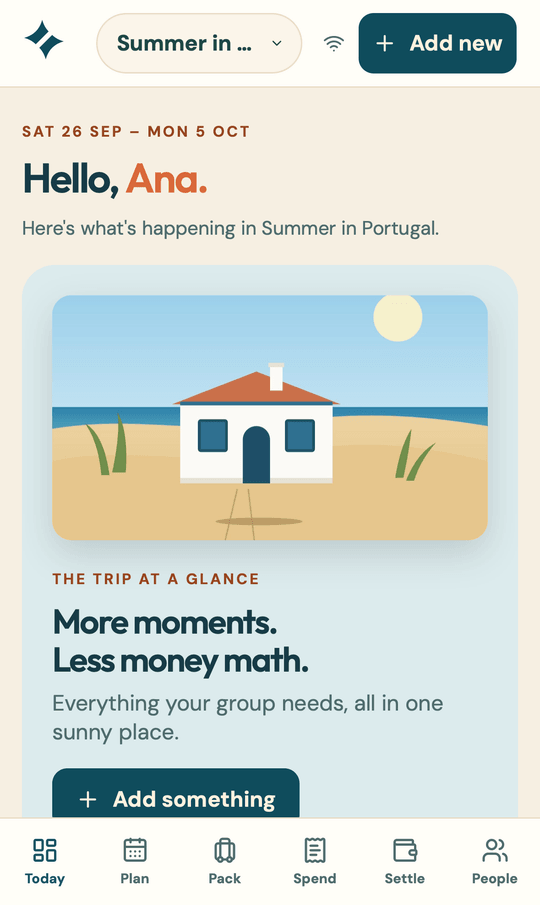
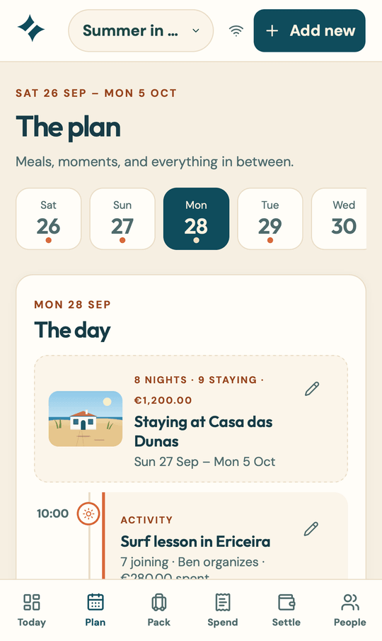
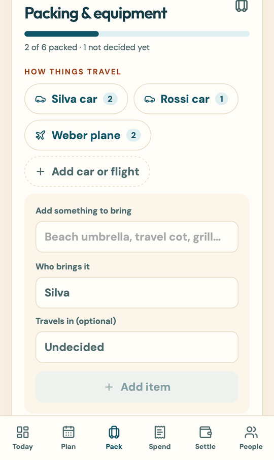
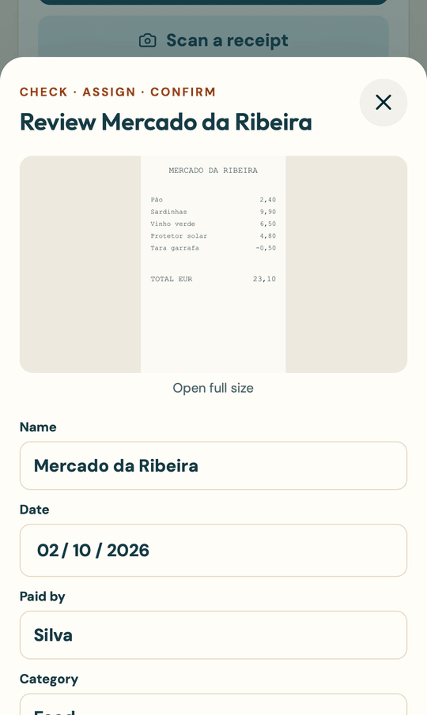
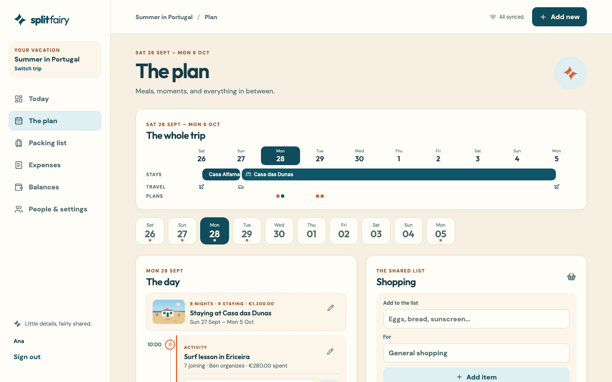
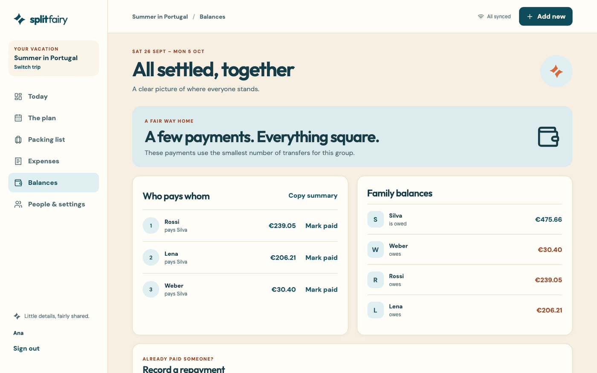
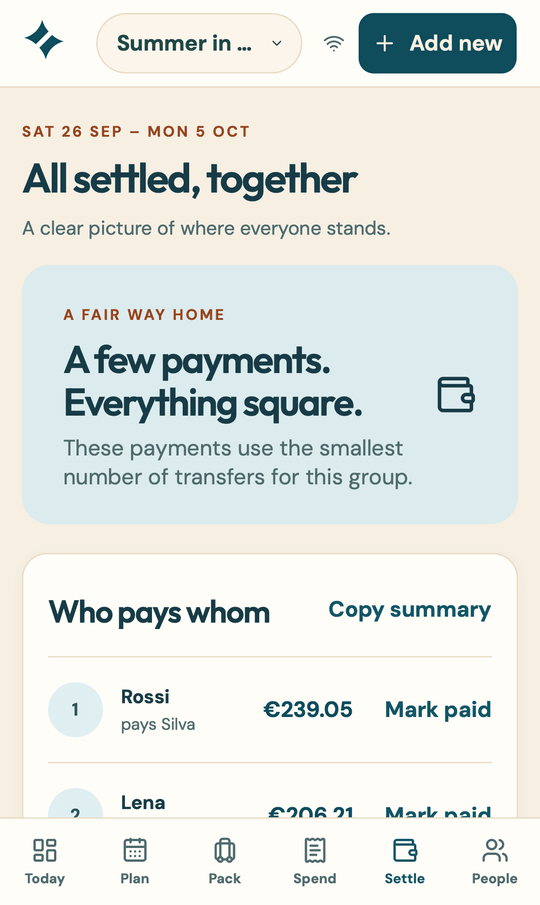
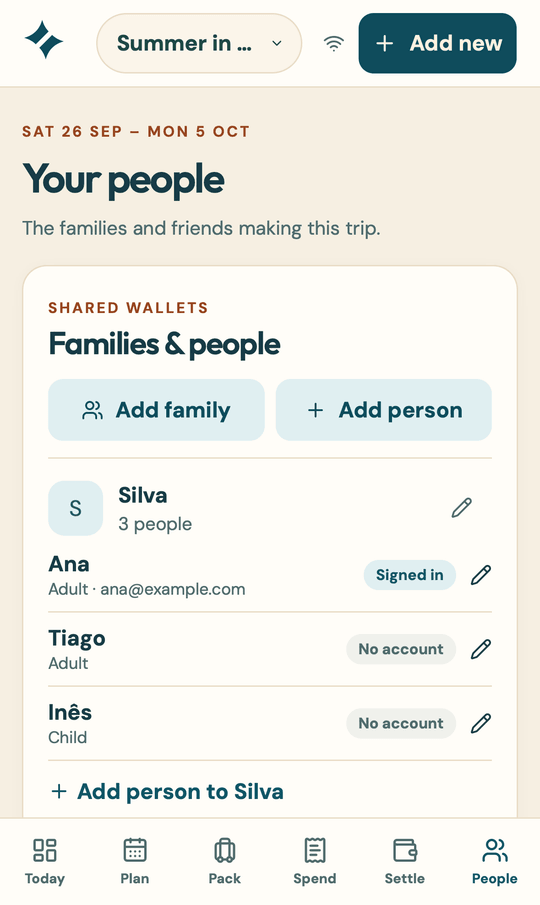
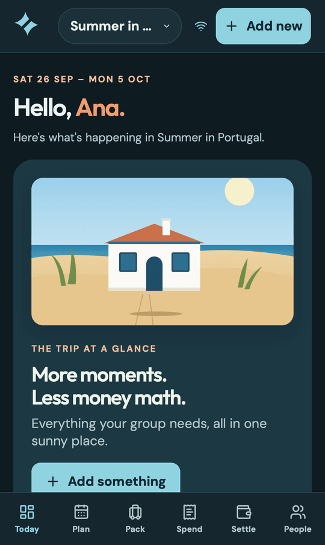
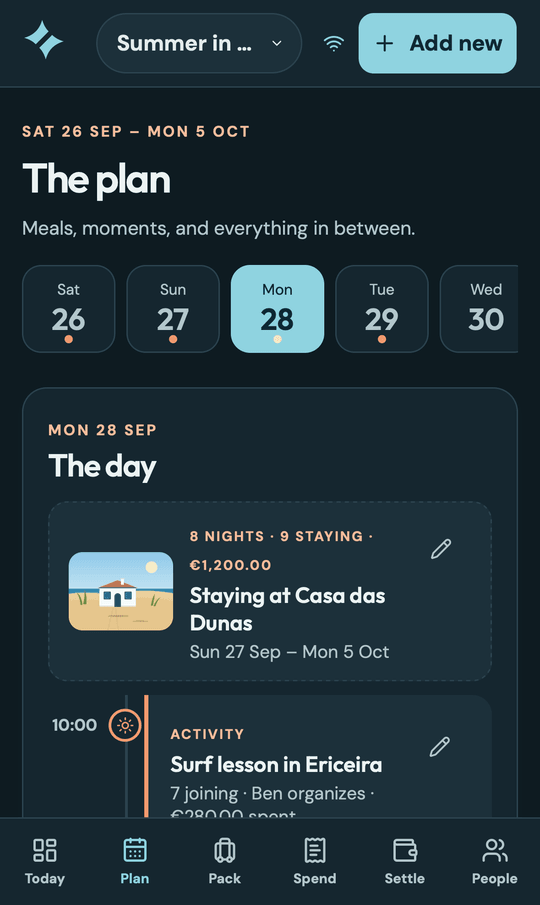

<p align="center"></p>

<h1 align="center">Splitfairy</h1>

<p align="center"><strong>So we split fairly.</strong><br>
A self-hosted, installable app for group vacations: plan the journey, stays, meals and activities, keep a shared shopping and packing list, scan receipts, and settle up fairly between families.</p>

<p align="center">
<a href="https://github.com/nachtschatt3n/splitfairy/actions/workflows/ci.yml"></a>
<a href="https://github.com/nachtschatt3n/splitfairy/releases"></a>
<a href="LICENSE"></a>
</p>

<p align="center">




</p>

## What it does

- **Families and people.** Add families, people who travel on their own, and kids. Everyone has a share of costs: an adult pays a full share, a child half, a baby nothing, or any custom weight. Adults can get an email invitation and sign in; children don't need an account.
- **Plan the days.** Each day is a timeline: breakfasts, dinners and activities with an optional time and notes, who joins and who organizes. Each meal has its own shopping items. Restaurants get an address (looked up on OpenStreetMap) and their bill instead of a shopping list.
- **Getting there and where you sleep.** Add flights and car drives with times and who travels, and stays with address, check-in and check-out, and who is staying. They show up on the day's timeline, with a map link and what each vehicle carries. A booking cost, with who paid, becomes an expense split among the people staying, and stays editable from the stay. On a wide screen, the whole trip is laid out at a glance.
- **Photos of the places.** Anyone on the trip can add photos of a stay. They show on the day's timeline, open full size, and the first one becomes the trip's cover.
- **Shopping list.** Shared, grouped by meal, ticked off as people buy things.
- **Packing and equipment.** Who brings the tent, the grill, the travel cot, and in which car or on which flight does it travel? Every item belongs to a family or waits for someone to take it, can travel in one car or flight or several in a row ("Weber plane → Silva car"), and gets ticked off when it's packed. The list can be grouped by family or by transport.
- **Expenses.** Add what you paid in seconds, for a meal, an activity or everyone. Split it equally, by exact amounts, percentages, shares or adjustments, or equally per family; it also handles refunds and several payers. The Spend page shows the total, a breakdown by category, and every expense by day.
- **Receipt scanning.** Take a photo. A private vision model (via [Ollama](https://ollama.com)) reads the items, and you check them next to the photo. Assign each item to a meal, an activity or everyone. Nothing counts until the items add up to the receipt total and a person confirms.
- **Fair balances.** Costs are split by each person's share to the cent and rolled up per family. Settle up suggests the smallest number of payments. Splitfairy records repayments; it never moves money.
- **A look for every trip.** Pick Coast, Alpine, City, Countryside or Classic when you create the trip; the whole app follows it, in light and dark mode.
- **Works offline.** Edits and receipt photos are kept on the phone and sync when you're back online. Install it to the home screen like an app.
- **Private by design.** Invitation-only sign-in with a six-digit email code, no passwords, no public signup. Everything runs in one container on your own server.

<p align="center">


</p>

<p align="center">




</p>

## How the money works

1. Every person has a **share**, for example 1 for adults and 0.5 for children. A family's share of a cost is the sum of its members' shares among the people taking part.
2. An expense is split among the people it's for: everyone, the people joining a meal or activity, or a selection. A scanned receipt is split **item by item**, so the sunscreen can go to everyone while the dinner groceries go only to the people eating.
3. Amounts are whole cents. Leftover cents are distributed deterministically, so every expense adds up exactly.
4. **Balances** are per family: what they paid minus their share, plus repayments. **Settle up** finds the minimum number of transfers for groups of up to 15 wallets, and a clearly labelled simplified plan beyond that.
5. Nothing is silently lost. Expenses are voided instead of deleted and can be restored, and every change to an expense is kept as a revision. A trip with money in it can only be archived, not deleted.

## Self-hosting

Splitfairy is a single Node.js 24 container that serves the app and its API. The image is `ghcr.io/nachtschatt3n/splitfairy:<version>`, and each release tag is the exact image that passed CI.

```sh
docker run -d --name splitfairy -p 3000:3000 -v splitfairy-data:/data \
  -e ADMIN_EMAIL=you@example.com \
  -e AUTH_SECRET="$(openssl rand -hex 32)" \
  -e SMTP_HOST=smtp.example.com -e SMTP_PORT=587 -e SMTP_SECURE=false \
  -e SMTP_USER=you@example.com -e SMTP_PASSWORD=... -e SMTP_FROM="Splitfairy <you@example.com>" \
  -e OLLAMA_URL=http://your-ollama:11434 -e OLLAMA_MODEL=gemma4:26b-mlx \
  ghcr.io/nachtschatt3n/splitfairy:v0.2.0
```

Put it behind HTTPS. The administrator (`ADMIN_EMAIL`) signs in first, creates trips and invites everyone else by adding their email to a person.

| Variable | Purpose |
|---|---|
| `ADMIN_EMAIL` | The only address that can sign in before anyone is invited; creates trips. |
| `AUTH_SECRET` | Random string, at least 32 characters. Signs sign-in codes. |
| `SMTP_HOST`, `SMTP_PORT`, `SMTP_SECURE`, `SMTP_USER`, `SMTP_PASSWORD`, `SMTP_FROM` | Outgoing mail for sign-in codes and invitations. `SMTP_SECURE=false` means STARTTLS on 587, `true` means TLS on 465. |
| `OLLAMA_URL`, `OLLAMA_MODEL` | Vision model for receipts. Without it, everything except receipt scanning works. |
| `DATA_DIR` | Where SQLite and receipt photos live (`/data` in the image). |
| `LOG_LEVEL` | `info` by default. Logs are JSON on stdout. |

**Storage.** Keep one replica on block storage. SQLite in WAL mode needs real file locking, so don't use NFS or SMB. The app writes a consistent backup of the database, receipts and photos to `/data/backups/YYYY-MM-DD` every night at 03:00 (Europe/Berlin) and keeps seven. Copy them off the volume as well. To restore, stop the app, copy `splitfairy.sqlite`, `receipts/` and `photos/` back into `/data`, and start it.

**Health.** `/healthz` reports that the process is up and `/readyz` that the database answers. The server shuts down cleanly on `SIGTERM`.

**When sign-in email is slow.** Codes last 30 minutes and are accepted however they're pasted. An operator with shell access to the container can issue a code with `node dist/server/scripts/signin-code.js someone@example.com` (only for the admin or invited addresses). Every email handed to the mail server is logged with its message id.

**Receipt model.** Run `npm run smoke:ai` against your Ollama host after changing the model or prompt. It sends a generated receipt through the real extraction path and checks every item, the total and the date.

See [docs/deployment.md](docs/deployment.md) for the release process and a Kubernetes/Flux setup.

## Development

Requires Node.js 24.

```sh
npm ci
cp .env.example .env    # set ADMIN_EMAIL and AUTH_SECRET; SMTP is optional locally
npm run dev             # API on :3000, app on http://localhost:5173
```

Without SMTP, set `MAIL_CAPTURE_DIR=./data/mail` and read sign-in codes from the JSON files written there.

| Command | What it does |
|---|---|
| `npm run check` | Typecheck, unit and API tests (money, settlement, access rules, receipts, offline queue), production build. |
| `npm run test:e2e` | Builds, then runs the browser tests: fast UI tests with a mocked API, and full flows against the real server on iPhone (WebKit and Chromium) and desktop. |
| `npm run screenshots` | Regenerates the screenshots in this README from an example trip. |
| `npm run smoke:ai` | Real receipt extraction against `OLLAMA_URL`; not part of CI. |

The browser tests cover the whole journey: email sign-in, planning, shopping, packing, expenses, receipt scan and review, settling up, switching trips, member invitations, and creating, editing and removing every kind of item. On every screen and dialog, in light and dark mode, they also check phone usability rules: no sideways scrolling, text fields of at least 16 px (smaller ones make iOS zoom), touch targets of at least 44 px, a bottom menu that respects the iPhone home indicator, and no serious accessibility or contrast problems (axe). Set `SHOT_DIR=/some/dir` to save a screenshot of every checked screen.

## Privacy and scope

Only invited email addresses can sign in. Receipt photos go only to the Ollama endpoint you configure. Offline changes stay in the browser until they sync, and signing out asks before discarding anything unsynced. Splitfairy uses euros and English, and has no bank transfers, currency conversion or public signup.

## License

[MIT](LICENSE) © 2026 Mathias Uhl
